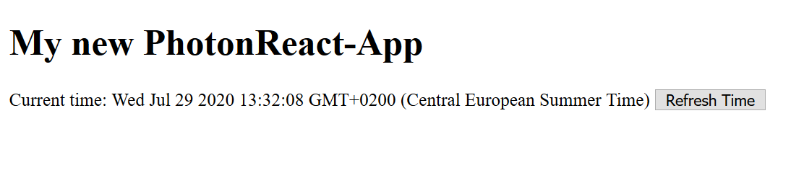

# PhotonReact - A lightweight state library for small web apps

Sometimes a framework like React.js or Vue.js ist just a bit of an overkill for your project. This is where PhotonReact fills the gap. It makes managing states a little more bearable while being a very small library.
 
## Getting Started

To use PhotonReact you first have to download the latest photonreact.js file. Keep in mind that photonreact needs jquery to run, so be sure to download and include it before photonreact.js. Like so:
```html
<head>
    ...
    <script src="path/to/jquery.min.js"></script>
    <script src="path/to/photonreact.min.js"></script>
    <script defer src="path/to/your/index.js"></script>
    ...
</head>
```

So how do I get it to run now? First we need to take a look at the HTML-Side of things.

Say your index.html looks something like this:
```html
<!doctype html>
<html lang="en">
<head>
    <meta charset="UTF-8">
    <script src="./node_modules/jquery/dist/jquery.min.js"></script>
    <script src="./lib/photonreact/photonreact.min.js"></script>
    <script defer src="./js/index.js"></script>
    <title>PhotonReact App</title>
</head>
<body>
    <h1>My new PhotonReact app</h1>
    <span>Current time:</span>
    <button id="time-btn">Refresh Time</button>
</body>
</html>
```

Let's say after ``Current time:`` you want to display the current time, and refresh it using the button with the id ``#time-btn``. How would I do this with PhotonReact?

First we need to add a placeholder in the html where we want the time variable/state to be:

```html
    <span>Current time: ${{time}}</span>
```

In text we use ``${{stateName}}`` to tell PhotonReact where to insert which state. 

Now let's create an ``index.js`` file and add some code to make ``body`` the PhotonReact root:

```javascript
let pr = new PhotonReact();

class Root extends PRRoot {
    constructor(prInstance, selector) {
        super(prInstance, selector); // We need to give PRRoot a PhotonReact instance and a selector
    }
}

new Root(pr, 'body'); // Initalize Root
```

Don't forget to create the Root instance.

Now to use state we need to add two lines of code:

```javascript
let pr = new PhotonReact();

class Root extends PRRoot {
    constructor() {
        super(pr, 'body'); // We need to give PRRoot a PhotonReact instance and a selector
        this.state = {time: new Date().toString()}; // Setting a new state named time and assigned it the value of the current time in string format
        this.prepareStates(); // Detect placeholders and filling in the states
    }
}

new Root();
```

Now our webpage should look something like this in the browser:



Nothing is happening yet when we press the button though so let's change that:

```javascript
let pr = new PhotonReact();

class Root extends PRRoot {
    constructor() {
        super(pr, 'body'); // We need to give PRRoot a PhotonReact instance and a selector
        this.state = {time: new Date().toString()}; // Setting a new state named time and assigned it the value of the current time in string format
        this.prepareStates(); // Detect placeholders and filling in the states

        $('#time-btn').click(() => {
            this.setState({time: new Date().toString()});
}       );
    }
}

new Root();
```

As you can see we add an event listener just how we normally do, just this time in the constructor so we can access the state of the app. Now our app refreshes the time everytime we press the button.

Of course this is just a basic example of what you can do with PhotonReact, to learn more visit the documentation.

## Current Limitations

* The nesting of PRRoots is not possible and will cause errors, it is advised to use PRRoots on main elements.

## Documentation

### States

#### Text states
To display states in text is fairly easy. It can be done by using the ``${{stateName}}`` placeholder or by using an element in this configuration: ``<span class="pr-state" data-pr-identifier="stateName"></span>``. ``${{}}``-placeholders automatically get replaced by spans in this setup so except if you want  to use a different tag type you should just use the placeholder syntax.

#### Array states
If your state is an array and used as the content of an element, PhotonReact automatically creates an element for each item of the array, the class name of which are ``stateName-item``. If you want more control for certain array states, you can use ``this.stateBehaviorOverride``.

#### Style states
To make a style of an element stateful you need to add the class ``pr-style`` and an attribute ``data-pr-style-state`` with the state name as value.
For example:
```html
<a class="pr-style" data-pr-style-state="linkStyle"></a>
```
The state for styles must be an object in this format:
```
{
    color: "#ff0000",
    backgroundColor: "#000",
    padding: "10px"
}
```

#### Class states
Sometimes you want to change the class of an element using states. How you do this is very similar to style states (just using ``pr-class`` as class and ``data-pr-class-state`` as attribute instead):
```html
<span class="pr-class" data-pr-class-state="spanClass"></span>
```
The state for classes must be an array similar to this one:
```
['active', 'blueHover']
```

#### Src states
Similar to classes you might want to have a state managing the source of an image. This is achieved by assigning the class ``pr-src`` and the attribute ``data-pr-src-state``. 
Example:
```html

```

The state for sources must be a string.

#### Input Value states
If you want the value of an input to be stateful you need to add the class ``pr-value`` and the attribute ``data-pr-value-state`` with the target state to the input. The state type should be the same as the input type.

```html
<input type="text" class="pr-value" data-pr-value-state="inpVal" />
```

#### Attribute states
To assign states for one or more attributes of an element you can assign the class ``pr-attr`` and the attribute ``data-pr-attr-states`` which value has to be a JSON object, in which the key determines the attribute to be changed and the value the state to be used, like this:

```html

```

#### State Behavior Override
Sometimes the way PhotonReact displays your states might not be enough for you; in that case you can override the way the state gets inserted into the page.

To override the behaviour of a state you need to create a function and map it to the desired state:

```javascript
class Root extends PRRoot {
    constructor(prInstance, selector) {
        super(prInstance, selector);
        this.state = {
            number: 4
        };
        this.stateBehaviorOverride = {
            number: state => this.numberOverride(state)
        };
        this.prepareStates();
    }

    numberOverride(state) {
        return state * 4;
    }
}

new Root(new PhotonReact(), 'body');
```

As you can see the state is given to the function as a parameter with which you can then can though whatever you want and the in the end you return the new html that should be inserted into the page. In this example we simply multiply the state number by 4 before returning it. State Behavior Overrides come in very handy for complex states like objects and such.

## Reference

### class PhotonReact

#### Attributes

``window.state`` In case you need a more global way of storing states.

#### Methods

``this.setState(stateObject)`` To set ``window.state``

``this.getState()`` To get ``window.state``

### class PRRoot

#### Attributes

``this.root`` The PhotonReact instance that was given to the constructor of the class.

``this.dom`` The DOM Element the class uses as reference.

``this.id`` The ID of the root

``this.children`` The children of ``this.dom``

``this.state`` Stores all the states of the PRRoot object.

``this.stateBehaviorOverride`` Specifies which state behaviours to override.

#### Methods

``this.prepareStates()`` Replaces state placeholders and fills in data.

``this.setState(stateObject)`` Is used to set the states of the object.

``this.refresh()`` Esentially ``this.prepareStates()`` but only used after construction.

``this.printState()`` Logs the states to the console.

